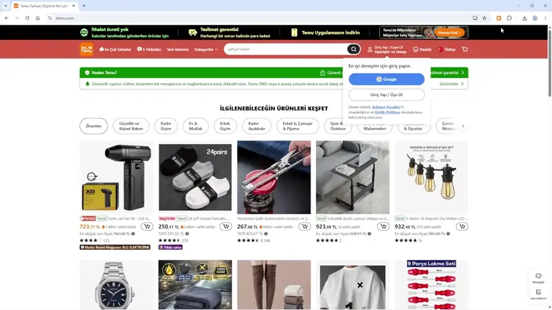

  

<h1 align="center">Temu Yerel Filtre</h1>

  Temu üzerindeki yerel depo ve satıcı ürünlerini otomatik olarak filtreleyen Manifest V3 tarayıcı eklentisi.

  

## Özellikler

- **Dinamik DOM Filtreleme:** Sayfa kaydırıldıkça yüklenen ürün kartlarını `MutationObserver` ve `WeakSet` önbelleği ile gecikmesiz filtreler.
- **Yerel Etiket Algılama:** `[Yerel]`, `Local`, `TR Depo` ve benzeri yerel depo etiketlerini tespit eder.
- **İki Farklı Çalışma Modu:**
  - *Tamamen Gizle:* Yerel ürün kartını DOM üzerinde gizleyerek ızgara (grid) düzenini korur.
  - *Soluklaştır:* Ürünü yarı saydam ve gri yapar, üzerine gelindiğinde ürün incelenebilir.
- **Sayaç Rozeti:** Sayfada filtrelenen yerel ürün adedini uzantı simgesi ve açılır menüde gösterir.
- **Gizlilik:** Ürün bilgisi toplamaz, yönlendirme (affiliate) kodu veya analitik içermez ve uzantı kendisi ağ isteği göndermez. Ayarlar `chrome.storage.sync` içinde saklanır; tarayıcı eşitlemesi açıksa açık/kapalı ve mod tercihleri tarayıcılar arasında eşitlenebilir.

## Kurulum

### Chrome / Edge / Brave

1. [**Buraya tıklayarak eklentiyi (.zip) indirin**](https://github.com/ozkancirak/temu-local-filter/releases/download/v1.0.0/temu-local-filter-v1.0.0.zip) ve arşivden bir klasöre çıkartın.
2. Tarayıcınızda uzantılar sayfasını açın:
   - Chrome: `chrome://extensions`
   - Edge: `edge://extensions`
3. Sağ üstteki **Geliştirici modu** anahtarını etkinleştirin.
4. **Paketlenmemiş öğe yükle** butonuna tıklayarak arşivden çıkardığınız klasörü seçin.

## Teşekkür

Bu proje, temel fikir olarak [@iltekin](https://github.com/iltekin)'in `remove-local-temu` eklentisinden esinlenerek Manifest V3 uyumluluğu ve temiz bir mimariyle sıfırdan yazılmıştır.

## Lisans

[MIT](LICENSE)
